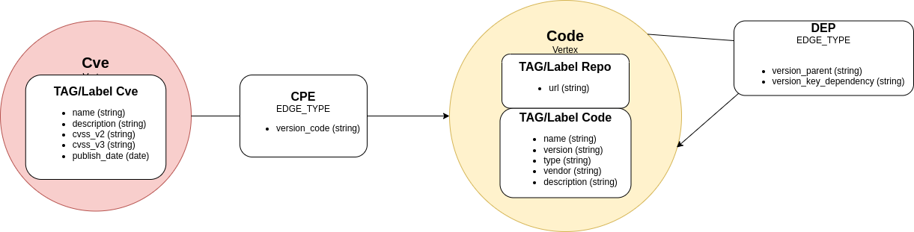

# CodeGraph

Validation of GitHub projects exposure to common vulnerabilities and exploits (CVEs) and dependecy visualization with graph UI.

Users can select GitHub repository and check vulnerability status for libraries, visually with attractive graph representation.

**Link to live demo** ->  https://secure.codegraph.space/

## GitHub data
- Repository URL
- Libraries in repository
- Links to other repositories

## CVE, CPE & NVD data
- CVE name
- Description
- CVSS v2 and v3 Base Score
- Known Affected Software Configuration (CPE)
- Publish date

## MemGraph Database

```bash
# install MemGraph database with docker
docker pull memgraph/memgraph-platform

docker run -it -d --name memgraph -p 7687:7687 -p 3000:3000 -e MEMGRAPH="--bolt-port=7687" \
-v mg_lib:/var/lib/memgraph -v mg_log:/var/log/memgraph -v mg_etc:/etc/memgraph  memgraph/memgraph-platform
```
```
# connect to MemGraph using MemgraphLab console
http://localhost:3000/lab/overview

# execute in Query console screen
CREATE INDEX ON :Cve(name);
CREATE INDEX ON :Code(name);
```

## Data Model

---

<p align="center">
  
</p>

---

```cypher
// Example data in Cypher syntax

// Cve Nodes

MERGE (cve:Cve { name: "CVE-2021-28377" }) ON CREATE SET cve.description="ChronoForums 2.0.11 allows av Directory Traversal to read arbitrary files.", cve.cvss_v2_score="5.0", cve.cvss_v3_score="5.3", cve.publish_date="2022-01-12";
MERGE (cve:Cve { name: "CVE-2022-0159" }) ON CREATE SET cve.description="orchardcore is vulnerable to Improper Neutralization of Input During Web Page Generation ('Cross-site Scripting')", cve.cvss_v2_score="3.5", cve.cvss_v3_score="5.4", cve.publish_date="2022-01-12";
MERGE (cve:Cve { name: "CVE-2022-20614" }) ON CREATE SET cve.description="A missing permission check in Jenkins Mailer Plugin 391.ve4a_38c1b_cf4b_ and earlier allows attackers with Overall/Read access to use the DNS used by the Jenkins instance to resolve an attacker-specified hostname.", cve.cvss_v2_score="4.0", cve.cvss_v3_score="4.3", cve.publish_date="2022-01-12";
MERGE (cve:Cve { name: "CVE-2021-4104" }) ON CREATE SET cve.description="JMSAppender in Log4j 1.2 is vulnerable to deserialization of untrusted data when the attacker has write access to the Log4j configuration. The attacker can provide TopicBindingName and TopicConnectionFactoryBindingName configurations causing JMSAppender to perform JNDI requests that result in remote code execution in a similar fashion to CVE-2021-44228. Note this issue only affects Log4j 1.2 when specifically configured to use JMSAppender, which is not the default. Apache Log4j 1.2 reached end of life in August 2015. Users should upgrade to Log4j 2 as it addresses numerous other issues from the previous versions.", cve.cvss_v2_score="6.0", cve.cvss_v3_score="7.5", cve.publish_date="2021-12-14";
MERGE (cve:Cve { name: "CVE-2020-9493" }) ON CREATE SET cve.description="A deserialization flaw was found in Apache Chainsaw versions prior to 2.1.0 which could lead to malicious code execution.", cve.cvss_v2_score="6.8", cve.cvss_v3_score="9.8", cve.publish_date="2021-06-16";
MERGE (cve:Cve { name: "CVE-2022-0087" }) ON CREATE SET cve.description="keystone is vulnerable to Improper Neutralization of Input During Web Page Generation ('Cross-site Scripting')", cve.cvss_v2_score="4.3", cve.cvss_v3_score="6.1", cve.publish_date="2022-01-12";
MERGE (cve:Cve { name: "CVE-2021-30353" }) ON CREATE SET cve.description="Improper validation of function pointer type with actual function signature can lead to assertion in Snapdragon Auto, Snapdragon Compute, Snapdragon Connectivity, Snapdragon Consumer IOT, Snapdragon Industrial IOT, Snapdragon Voice & Music, Snapdragon Wearables", cve.cvss_v2_score="5.0", cve.cvss_v3_score="7.5", cve.publish_date="2022-01-13";
MERGE (cve:Cve { name: "CVE-2022-21860" }) ON CREATE SET cve.description="Windows AppContracts API Server Elevation of Privilege Vulnerability.", cve.cvss_v2_score="4.4", cve.cvss_v3_score="7.0", cve.publish_date="2022-01-11";
MERGE (cve:Cve { name: "CVE-2022-21864" }) ON CREATE SET cve.description="Windows UI Immersive Server API Elevation of Privilege Vulnerability.", cve.cvss_v2_score="4.4", cve.cvss_v3_score="7.0", cve.publish_date="2022-01-11";
MERGE (cve:Cve { name: "CVE-2021-30330" }) ON CREATE SET cve.description="Possible null pointer dereference due to improper validation of APE clip in Snapdragon Auto, Snapdragon Compute, Snapdragon Connectivity, Snapdragon Consumer IOT, Snapdragon Industrial IOT, Snapdragon Voice & Music, Snapdragon Wearables", cve.cvss_v2_score="5.0", cve.cvss_v3_score="7.5", cve.publish_date="2022-01-13";
MERGE (cve:Cve { name: "CVE-2022-21865" }) ON CREATE SET cve.description="Connected Devices Platform Service Elevation of Privilege Vulnerability.", cve.cvss_v2_score="4.4", cve.cvss_v3_score="7.0", cve.publish_date="2022-01-11";


// Code Nodes and CPE Edges

MERGE (code:Code:Repo { name: "easy_forms_for_mailchimp" });
MATCH (cve:Cve {name: "CVE-2021-24985" }),(code:Code { name: "easy_forms_for_mailchimp" }) MERGE (cve)-[:CPE { version_code: "<:6.8.6" }]->(code);
MATCH (cve:Cve {name: "CVE-2019-15318" }),(code:Code { name: "easy_forms_for_mailchimp" }) MERGE (cve)-[:CPE { version_code: "<:6.5.3" }]->(code);

MERGE (code:Code:Repo { name: "log4sh" });
MATCH (cve:Cve {name: "CVE-2005-1915" }),(code:Code { name: "log4sh" }) MERGE (cve)-[:CPE { version_code: "==:1.2.5" }]->(code);
MATCH (cve:Cve {name: "CVE-2005-1915" }),(code:Code { name: "log4sh" }) MERGE (cve)-[:CPE { version_code: "==:1.2.3" }]->(code);
MATCH (cve:Cve {name: "CVE-2005-1915" }),(code:Code { name: "log4sh" }) MERGE (cve)-[:CPE { version_code: "==:1.2.4" }]->(code);

MERGE (code:Code:Repo { name: "dolphin_browser" });
MATCH (cve:Cve {name: "CVE-2010-1730" }),(code:Code { name: "dolphin_browser" }) MERGE (cve)-[:CPE { version_code: "==:2.5.0" }]->(code);

MERGE (code:Code:Repo { name: "zipwrangler" });
MATCH (cve:Cve {name: "CVE-2010-1685" }),(code:Code { name: "zipwrangler" }) MERGE (cve)-[:CPE { version_code: "==:1.20" }]->(code);
```
